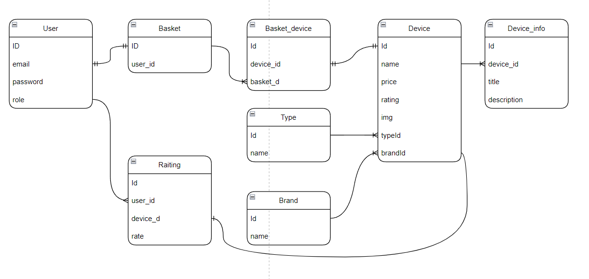

# Online shop :package:

# Overview
This project is the implementation of a complete site to implement the basic skills that were acquired during the study of one discipline. The site is an online store, with the implementation of the basic necessary features.
***

The main goal of any online store is to attract more potential buyers and get more sales with the lowest budget costs for advertising.

In fact, the best visitor ratings are not to increase visitor ratings, but to improve customer conversion rates. And one of the proven and reliable ways to increase sales is to improve the usability of the store.

# Tech stack
Backend:
- Node.js
- Express
- PostgreSQL
- Sequelize

# Database schema

